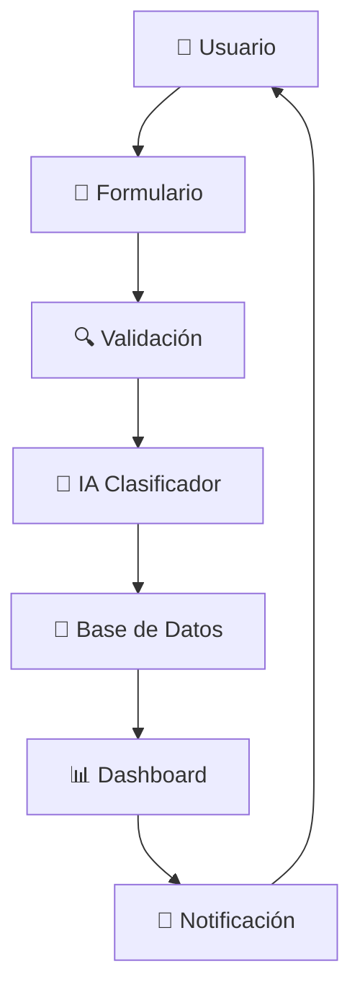

# 🏛️ **Sistema de Gestión de Trámites - Municipalidad de Yau**

<div align="center">
  
  
  
  
  
  

  **🚀 Una solución moderna para la gestión eficiente de trámites municipales**
  
  [🎯 Demo](#-demo) • [📦 Instalación](#-instalación-rápida) • [🔧 Uso](#-uso) • [📖 Documentación](#-documentación-completa)

</div>

---

## 🌟 **¿Por qué este sistema?**

> **"Del caos al orden en 3 clicks"** ⚡

### 🔥 **Antes vs Después**

| 😩 **Antes** | 🎉 **Después** |
|-------------|----------------|
| 📄 Papeles perdidos | 💾 Todo centralizado |
| ⏰ Procesos lentos | 🚀 Clasificación automática |
| 🤷 Sin seguimiento | 📊 Dashboards en tiempo real |
| 😵 Interfaz aburrida | ✨ Diseño moderno y atractivo |

---

## 🎯 **Características Principales**

### 🤖 **Inteligencia Artificial Integrada**
- **Clasificación automática** de trámites con Machine Learning
- **Predicción de tiempos** basada en datos históricos
- **Priorización inteligente** (Alta/Normal según complejidad)

### 💎 **Experiencia de Usuario Premium**
- **Interfaz moderna** con Tailwind CSS
- **Animaciones fluidas** y efectos visuales
- **Responsive design** para móviles y tablets
- **Validación en tiempo real** de formularios

### 📊 **Gestión Avanzada**
- **Dashboard intuitivo** con métricas clave
- **Seguimiento completo** del ciclo de vida
- **Notificaciones por email** automáticas
- **Reportes y estadísticas** detalladas

---

## 🚀 **Instalación Rápida**

### 📋 **Prerrequisitos**
```bash
# Verifica tu versión de Python
python --version  # Necesitas Python 3.8+
```

### ⚡ **Instalación en 4 pasos**

#### 1️⃣ **Clona el repositorio**
```bash
git clone https://github.com/municipalidad-yau/gestion-tramites.git
cd gestion-tramites
```

#### 2️⃣ **Crea entorno virtual**
```bash
python -m venv venv

# Windows
venv\Scripts\activate

# macOS/Linux
source venv/bin/activate
```

#### 3️⃣ **Instala dependencias**
```bash
pip install -r requirements.txt
```

#### 4️⃣ **Inicializa la base de datos**
```bash
python init_db.py
```

### 🎉 **¡Listo para usar!**
```bash
python app.py
```
Visita: `http://localhost:5000` 🌐

---

## 🔧 **Uso**

### 📝 **Registrar un nuevo trámite**

1. **🏠 Accede al sistema** → `http://localhost:5000`
2. **📋 Completa el formulario:**
   - **Tipo:** Licencia, Permiso, Certificado, etc.
   - **📅 Fecha:** Fecha de inicio (no anterior a hoy)
   - **⏱️ Tiempo:** Días estimados (1-30)
   - **📧 Email:** Para notificaciones
3. **🚀 Envía** y recibe confirmación automática
4. **📊 Visualiza** en el dashboard en tiempo real

### 🎨 **Interfaz Visual**

```
┌─────────────────────────────────────┐
│  🏛️ MUNICIPALIDAD DE YAU            │
│     Sistema de Gestión de Trámites  │
├─────────────────────────────────────┤
│                                     │
│  📊 ESTADÍSTICAS EN TIEMPO REAL     │
│  ┌─────┐ ┌─────┐ ┌─────┐           │
│  │ 📄12│ │ ✅ 8│ │⏱️4.2│           │
│  │Pend.│ │Comp.│ │Días │           │
│  └─────┘ └─────┘ └─────┘           │
│                                     │
│  🆕 NUEVO TRÁMITE                   │
│  [Formulario Inteligente]           │
│                                     │
│  📋 TRÁMITES RECIENTES              │
│  [Lista con Estados Dinámicos]     │
│                                     │
└─────────────────────────────────────┘
```

---

## 🏗️ **Arquitectura del Sistema**

### 📁 **Estructura de Archivos**
```
gestion-tramites/
├── 🐍 app.py                    # Servidor Flask principal
├── 🤖 Clasi_prio.py            # Motor de IA para clasificación
├── 🗄️ tramites.db              # Base de datos SQLite
├── 📊 tramites_historicos.csv   # Datos para entrenar IA
├── 📁 templates/               # Plantillas HTML
│   ├── 🏠 inicio.html          # Dashboard principal
│   └── ✅ exito.html           # Página de confirmación
├── 📦 requirements.txt        # Dependencias Python
├── 🚀 init_db.py             # Script de inicialización
└── 📖 README.md              # Esta documentación
```

### 🔄 **Flujo de Datos**


---

## 🛠️ **Stack Tecnológico**

### 🎯 **Backend**
- **🐍 Python 3.8+** - Lenguaje principal
- **🌶️ Flask 2.0+** - Framework web minimalista
- **🗄️ SQLite 3** - Base de datos embebida
- **🤖 Scikit-learn** - Machine Learning

### 🎨 **Frontend**  
- **🌐 HTML5** - Estructura semántica
- **🎨 Tailwind CSS** - Diseño utility-first
- **✨ CSS Animations** - Efectos visuales fluidos
- **⚡ JavaScript ES6** - Interactividad moderna

### 📊 **Datos y ML**
- **🐼 Pandas** - Manipulación de datos
- **📈 Regression Models** - Predicción automática
- **🏷️ Label Encoding** - Procesamiento de categorías

---

## 🎮 **Funcionalidades Detalladas**

### 🤖 **Sistema de IA**
```python
# Ejemplo de clasificación automática
def clasificar_tramite(tiempo_estimado):
    if tiempo_estimado <= 3:
        return "🚀 Servicio Express"
    elif tiempo_estimado <= 7:
        return "📋 Trámite Estándar"  
    else:
        return "🏗️ Proceso Complejo"
```

### 🎯 **Priorización Inteligente**
- **🔴 ALTA** → Más de 5 días
- **🟡 NORMAL** → 5 días o menos
- **⚡ EXPRESS** → Menos de 2 días

### 📊 **Métricas en Tiempo Real**
- ⏳ Trámites pendientes
- ✅ Completados hoy
- 📈 Tiempo promedio de procesamiento
- 👥 Satisfacción ciudadana

---

## 🐛 **Solución de Problemas**

### ❓ **Problemas Comunes**

<details>
<summary>🚫 <strong>Error: "No module named 'flask'"</strong></summary>

```bash
# Solución:
pip install flask
# o instala todas las dependencias:
pip install -r requirements.txt
```
</details>

<details>
<summary>🚫 <strong>Error: "Database locked"</strong></summary>

```bash
# Solución:
# Cierra todas las instancias de la app y ejecuta:
python init_db.py
```
</details>

<details>
<summary>🚫 <strong>La página no carga estilos</strong></summary>

```bash
# Verifica conexión a internet para Tailwind CDN
# O descarga Tailwind localmente si es necesario
```
</details>

### 📞 **¿Necesitas ayuda?**
- 📧 Email: soporte@municipalidad-yau.gov
- 💬 Slack: #tramites-soporte  
- 📱 WhatsApp: +51 999 999 999

---

## 🚀 **Roadmap de Desarrollo**

### 🎯 **Versión 2.0** (Próximamente)
- [ ] 🔐 Sistema de autenticación OAuth
- [ ] 📱 App móvil nativa (React Native)
- [ ] 🔔 Notificaciones push en tiempo real
- [ ] 📊 Dashboard para administradores
- [ ] 🤖 Chatbot de soporte con IA

### 🌟 **Versión 2.5** (En planificación)
- [ ] 💳 Pagos en línea integrados
- [ ] 📄 Generación automática de documentos PDF
- [ ] 🗺️ Integración con mapas para ubicaciones
- [ ] 📈 Analytics avanzados con ML
- [ ] 🌐 API REST pública

---

## 🤝 **Contribuir**

### 🎯 **¿Cómo contribuir?**

1. **🍴 Fork** el repositorio
2. **🌿 Crea** tu branch: `git checkout -b feature/AmazingFeature`
3. **💻 Commit** tus cambios: `git commit -m 'Add some AmazingFeature'`
4. **🚀 Push** al branch: `git push origin feature/AmazingFeature`
5. **📝 Abre** un Pull Request

### 👥 **Contribuidores**
<div align="center">

[](https://github.com/municipalidad-yau/gestion-tramites/graphs/contributors)

</div>

---

## 📊 **Estadísticas del Proyecto**

<div align="center">


</div>

---

## 📄 **Licencia**

Este proyecto está bajo la licencia MIT. Ver el archivo [LICENSE](LICENSE) para más detalles.

```
MIT License - ¡Úsalo, modifícalo, mejóralo! 🚀
```

---

## 🙏 **Agradecimientos**

- 🏛️ **Municipalidad de Yau** por confiar en la innovación
- 👨‍💻 **Equipo de desarrollo** por su dedicación
- 🤖 **Comunidad Open Source** por las herramientas increíbles
- 👥 **Beta testers** por su feedback valioso

---

<div align="center">

### 🌟 **¡Dale una estrella si te gustó el proyecto!** ⭐

**Hecho con ❤️ en Perú 🇵🇪**

[⬆️ Volver arriba](#-sistema-de-gestión-de-trámites---municipalidad-de-yau)

</div>